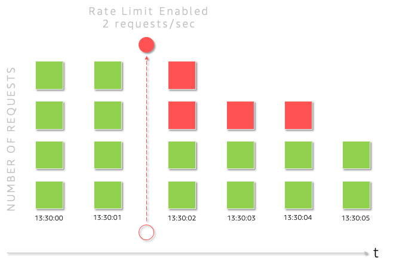
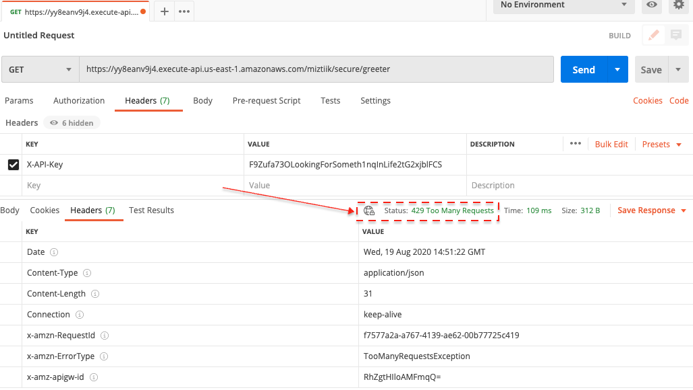

# API Best Practices: Highly Performant Design - API Keys | Rate Limiting with Usage Plan

Mystique Unicorn App is a building new application based on microservice architectural pattern. The app provides updates on events in real-time. At any given time, there will be a number of users querying for the same data (Very much like match data of a sporting event). During the event, Many users will be using the query to check the latests stats on the match event. The app exposes for third party developers and partners to access the data and build their own dashboards.

They are exploring two offerings: Free Tier & Premium Tier. All APIs call need to be made with a valid api-key generated by the app. In the free tier developer accounts will be limited to `1` request per second and premium tier will be allowed to make `10` requests per second.

Can you help them do that in Amazon API Gateway?

## 🎯Solutions

Rate limiting protects your APIs from overuse by limiting how often each user can call the API. This protects them from inadvertent or malicious overuse. Without rate limiting, each user may request as often as they like, which can lead to spikes of requests that starve other consumers. After rate limiting is enabled, they are limited to a fixed number of requests per second.



In the above image, When rate limiting of `2 reqs/sec` was enabled at _13:30:01_ all requests above the limit are denied(_shown in red_). Amazon API Gateway throttles requests to your API using the token bucket algorithm<sup>[1][2]</sup>


In this article, we will build the above architecture. using Cloudformation generated using [AWS Cloud Development Kit (CDK)][102]. The architecture has been designed in a modular way so that we can build them individually and integrate them together. The prerequisites to build this architecture are listed below

1.  ## 🧰 Prerequisites

    This demo, instructions, scripts and cloudformation template is designed to be run in `us-east-1`. With few modifications you can try it out in other regions as well(_Not covered here_).

    - 🛠 AWS CLI Installed & Configured - [Get help here](https://youtu.be/TPyyfmQte0U)
    - 🛠 AWS CDK Installed & Configured - [Get help here](https://www.youtube.com/watch?v=MKwxpszw0Rc)
    - 🛠 Python Packages, _Change the below commands to suit your OS, the following is written for amzn linux 2_
      - Python3 - `yum install -y python3`
      - Python Pip - `yum install -y python-pip`
      - Virtualenv - `pip3 install virtualenv`

1.  ## ⚙️ Setting up the environment

    - Get the application code

      ```bash
      git clone https://github.com/miztiik/secure-api-with-keys
      cd secure-api-with-keys
      ```

1.  ## 🚀 Prepare the dev environment to run AWS CDK

    We will cdk to be installed to make our deployments easier. Lets go ahead and install the necessary components.

    ```bash
    # If you DONT have cdk installed
    npm install -g aws-cdk

    # Make sure you in root directory
    python3 -m venv .env
    source .env/bin/activate
    pip3 install -r requirements.txt
    ```

    The very first time you deploy an AWS CDK app into an environment _(account/region)_, you’ll need to install a `bootstrap stack`, Otherwise just go ahead and deploy using `cdk deploy`.

    ```bash
    cdk bootstrap
    cdk ls
    # Follow on screen prompts
    ```

    You should see an output of the available stacks,

    ```bash
    unsecure-api
    secure-api-with-keys
    ```

1.  ## 🚀 Deploying the application

    Let us walk through each of the stacks,

    - **Stack: unsecure-api**
      We are going to deploy a simple api running as a lambda function. This API is deployed as public endpoint without any usage plan or api-keys. When the api is invoked, The backend processess the request adds an timestamp to the response

      There are two api resources available for us,

      - `{UNCACHED_API_URL}` - Every invocation will return a random movie item data
      - `{UNCACHED_API_URL}/{id}` - As this is a sample, there are only _10_ movies in the database.You can also invoke query the database for a movie by providing an _id_. The _id_ value can be between `{0..9}`

      Initiate the deployment with the following command,

      ```bash
      cdk deploy unsecure-api
      ```

      _Expected output:_
      The `UnSecureApiUrl` can be found in the outputs section of the stack,

      ```bash
      $ UNSECURE_API_URL="https://94zj9dm1x8.execute-api.us-east-1.amazonaws.com/miztiik/unsecure/greeter"
      $ curl ${UNSECURE_API_URL}
      {
        "message": "Hello from Miztiikal World, How is it going?",
        "ts": "2020-08-19 13:59:33.621248"
      }
      ```

      Here you can observe that the url can be invoked by anybody and does not require any `api-key` and is only subject to the account level throttling limits. This is _NOT_ what we wants. Lets go ahead and fix that.

    - **Stack: secure-api-with-keys**

      This stack:_secure-api-with-keys_ is very much similar to the previous stack. In addition to that, We will also add an usage plan along with api-keys. We will create two usage plan,

      - Developer Kon Usage Plan:
        - This plan will allow the user to make limited requests to the API, very much similar to a free tier
        - Rate Limit:`1`
        - Burst Limit:`1`
      - Partner Mystique Usage Plan:
        - This plan will allow the user to make 10requests to the API. This translate to about 36K/min. Since the user also have a higher burst limit, this user can can handle high volume bursty traffic
        - Rate Limit:`10`
        - Burst Limit:`100`

      For both the plans, we will let AWS create a _API-Key_ for our users. We can retrieve them from the console after the stack is deployed. Initiate the deployment with the following command,

      ```bash
      cdk deploy secure-api-with-keys
      ```

      Check the `Outputs` section of the stack to access the `SecureApiWithKeysUrl`

1.  ## 🔬 Testing the solution

    We can use a tool like `curl` or `Postman` to query the urls. The _Outputs_ section of the respective stacks has the required information on the urls

    In addition to the urls, you will also need the _api-key_ to make an authorized request to the secure url.

    1. In API Management Console, Choose this api **secure_api_with_keys_01**
    1. Navigte to **API Keys**
    1. Choose **Developer-Kon-Key** (You can retrive the partner key and test them later)
    1. On the right hand size, Click **Show** next to the API key
    1. Update the below script with your `SecureApiWithKeysUrl` & `Developer-Kon-Key`
    1. Run the following script from a `bash` terminal

       This is going to do make 30 requests to our API with api-key added in the header `X-API-Key` of each request. As we send requests beyound our `rate-limit` API Gateway will respond back with `HTTP/429` error message. Likewise, if you make the request with out the `X-API-Key` or _incorrect_ api-key value, API GW will throw different errors. We have also set a limit on our backend lambda concurrent executions to `20` per second. So any requests more than that will throw an `500` error.

    ```bash
    LOG_FILE_NAME="miztiik_secure_api_with_keys.log"
    SECURE_API_WITH_KEYS_URL="https://yy8eanv9j4.execute-api.us-east-1.amazonaws.com/miztiik/secure/greeter"
    DEV_KON_API_KEY="F9Zufa73OLookingForSometh1nqInLife2tG2xjblFCS"
    touch "${LOG_FILE_NAME}"
    > "${LOG_FILE_NAME}"
    for i in {1..30}
    do
      curl -s -w '{"status": "%{http_code}"}\n' \
        --header "X-API-Key: ${DEV_KON_API_KEY}" \
        -X GET "${SECURE_API_WITH_KEYS_URL}" >> "${LOG_FILE_NAME}" &
    done
    ```

    Expected Output(_When you open log file `LOG_FILE_NAME`, you should be able to find text similar to the ones shown below_)

    ```bash
    {"message":"Too Many Requests"}{"status": "429"}
    {"message": "Internal server error"}{"status": "500"}
    {"message": "Hello from Miztiikal World, How is it going?","ts": "2020-08-19 14:38:15.010419"}{"status": "200"}
    ```

    If you are using Postman tool, Checking the url with and without the api-key.

    

    If you are making too many requests from postman, you can notice the `429` errors,

    

    Now if you can repeat the above script with `partner API-Key` and you should be able to see more `200` responses

    Here we have demonstrated how to secure our API with API Keys and also offer a differentiated user experience with different usage plans and throttling limits. If you are using APIs in any regard, consider these rate limiting techniques to increase security, business impact, and efficiency across the board.

    _Additional Learnings:_ You can check the logs in cloudwatch for more information or increase the logging level of the lambda functions by changing the environment variable from `INFO` to `DEBUG`

1.  ## 📒 Conclusion

    Rate limiting with API Keys are a good way to maintain your APIs. To identify the best usage plans and rate limiting for your APIs try to find answers for the following questions:

    - Do all my API need rate limits?
      - Does all the APIs that need rate limits have rate limits?
      - Does all methods needs rate limits?
    - What happens if users exceed the rate limits? _Hard Vs Soft_ Limits
      - When users exceed the threshold, do they get throttled with slower responses?
      - Or Do they get blocked until they fall below permissible limits?
      - Do you charge for overage?
    - What status codes are sent if rate limits are exceeded?
    - What kind of usage plan should i use to differentiate my services between free and premium tier tiers of the API?

1)  ## 🧹 CleanUp

    If you want to destroy all the resources created by the stack, Execute the below command to delete the stack, or _you can delete the stack from console as well_

    - Resources created during [Deploying The Application](#deploying-the-application)
    - Delete CloudWatch Lambda LogGroups
    - _Any other custom resources, you have created for this demo_

    ```bash
    # Delete from cdk
    cdk destroy

    # Follow any on-screen prompts

    # Delete the CF Stack, If you used cloudformation to deploy the stack.
    aws cloudformation delete-stack \
        --stack-name "MiztiikAutomationStack" \
        --region "${AWS_REGION}"
    ```

    This is not an exhaustive list, please carry out other necessary steps as maybe applicable to your needs.

## 📌 Who is using this

This repository aims to teach how to enhance api security to new developers, Solution Architects & Ops Engineers in AWS. Based on that knowledge these Udemy [course #1][103], [course #2][102] helps you build complete architecture in AWS.

### 💡 Help/Suggestions or 🐛 Bugs

Thank you for your interest in contributing to our project. Whether it's a bug report, new feature, correction, or additional documentation or solutions, we greatly value feedback and contributions from our community. [Start here][200]

### 👋 Buy me a coffee

[](https://ko-fi.com/Q5Q41QDGK) Buy me a [coffee ☕][900].

### 📚 References

1. [API Gateway Caches are local to regions][1]

1. [Find latency of requests to edge-optimized API][2]

1. [Troubleshooting API Gateway][3]

1. [Choose an API key source `HEADER` or `AUTHORIZER`][4]

### 🏷️ Metadata

**Level**: 300


[1]: https://en.wikipedia.org/wiki/Token_bucket
[2]: https://docs.aws.amazon.com/apigateway/latest/developerguide/api-gateway-request-throttling.html
[3]: https://aws.amazon.com/premiumsupport/knowledge-center/api-gateway-troubleshoot-403-forbidden
[4]: https://docs.aws.amazon.com/apigateway/latest/developerguide/api-gateway-api-key-source.html
[100]: https://www.udemy.com/course/aws-cloud-security/?referralCode=B7F1B6C78B45ADAF77A9
[101]: https://www.udemy.com/course/aws-cloud-security-proactive-way/?referralCode=71DC542AD4481309A441
[102]: https://www.udemy.com/course/aws-cloud-development-kit-from-beginner-to-professional/?referralCode=E15D7FB64E417C547579
[103]: https://www.udemy.com/course/aws-cloudformation-basics?referralCode=93AD3B1530BC871093D6
[200]: https://github.com/miztiik/secure-api-with-keys/issues
[899]: https://www.udemy.com/user/n-kumar/
[900]: https://ko-fi.com/miztiik
[901]: https://ko-fi.com/Q5Q41QDGK
